# kern — Roadmap

| 항목 | 내용 |
|---|---|
| 문서 버전 | 0.2 (Windows·drill MVP 반영) |
| 작성일 | 2026-09-21 |
| 기준 문서 | `prd.md` v0.2 |
| 단위 | "세션" = Claude Code 작업 세션 1회(2~4시간 가정). 🟡 추정치, 실측 후 갱신 |

---

## 0. 원칙

1. **세로 슬라이스**: 각 단계는 끝나면 사용자가 실제로 쓸 수 있는 흐름 하나를 완성한다. "데이터 계층만 다 만들고 UI는 나중에" 식 가로 슬라이스 금지.
2. **샘플 시험으로 검증**: 모든 단계의 완료 기준(DoD)은 `examples/sample-cert/` 로 재현 가능해야 한다. 실제 시험 데이터는 DoD에 쓰지 않는다.
3. **결정적 로직 먼저 테스트**: `scripts/` 의 함수는 단위 테스트 없이 다음 단계로 넘어가지 않는다.
4. **단계 안에서만 리팩토링**: 다음 단계 착수 전 `claude plugin validate` + 단위 테스트 + `evals/` 통과.

---

## 1. 단계 요약

```mermaid
gantt
    dateFormat  X
    axisFormat  %s
    section 기반
    S0 뼈대·툴체인            :s0, 0, 2
    S1 데이터 계층·init-exam   :s1, after s0, 3
    section 입력
    S2 ingest·youtube        :s2, after s1, 4
    section 문제 엔진
    S3 generate·verify·solve·graders :s3, after s2, 4
    S4 mock·serve·grade      :s4, after s3, 3
    section 학습 루프
    S5 review(FSRS)·weakmap·hook·router·drill :s5, after s4, 4
    S6 crash·plan·probe        :s6, after s5, 2
    section 검증·확장
    S7 두 번째 샘플 시험·schema v2·essay_rubric :s7, after s6, 3
    S8 대시보드(선택)          :s8, after s7, 2
```

| 단계 | 이름 | 완료 시 사용자가 할 수 있는 것 | 세션 🟡 |
|---|---|---|---|
| S0 | 뼈대·툴체인 | 플러그인 로드, `kern --version`, 테스트 실행 | 1~2 |
| S1 | 데이터 계층·`init-exam` | 출제기준으로 `exam.yaml`·`taxonomy.md` 생성 | 2~3 |
| S2 | `ingest`·`youtube` | 기출 PDF·강의 요약을 문제은행·이론 노트로 | 3~4 |
| S3 | `generate`·`verify`·`solve`·핸들러 | 문제 생성·검증·단일 문항 풀이·채점 | 3~4 |
| S4 | `mock`·`serve`·`grade` | 브라우저 모의고사 → 자동 저장 → 채점표 | 2~3 |
| S5 | `review`·`weakmap`·훅·라우터·`drill` | 매 세션 복습 큐·약점 지도·`/kern` 추천·오류 시뮬레이터 훈련 | 3~4 |
| S6 | `crash`·`plan`·`probe` | 나머지 튜터 3모드 | 2 |
| S7 | 두 번째 샘플 시험 | G1 검증, `schema_version: 2`, `essay_rubric` | 2~3 |
| S8 | 대시보드(선택) | 집계 JSON → Obsidian Charts / 단일 HTML | 1~2 |

**MVP = S0~S5** (`drill` 포함). S6부터는 MVP 위에 얹는다.

---

## 2. 단계별 상세

### S0 — 뼈대·툴체인

**산출물**
- `kern/.claude-plugin/plugin.json` (name, version, description, license MIT)
- `kern/skills/` 빈 디렉토리 + 라우터 `skills/kern/SKILL.md` 스텁
- `kern/scripts/` TypeScript 소스(`src/`, `test/`). `package.json`(Node ≥ 22.18, `"type": "module"`)·`tsconfig.json`(타입 검사 전용)·`package-lock.json` 은 **플러그인 루트 `kern/`** 에 둔다(결정 0001). 빌드·`dist` 없음, 테스트 러너(Node 내장 `node:test` 우선, 부족하면 vitest), `package-lock.json` 필수(플러그인 캐시 설치가 npm lockfile 을 요구)
- `kern/bin/kern` — `scripts/src/cli.ts` 진입점
- `kern/hooks/hooks.json` — SessionStart 스텁(침묵)
- `kern/evals/` — 케이스 1개(플러그인 로드 확인)
- `examples/sample-cert/` — 자작 시험 프로파일 초안(과목 2, 문항 40, 과락/평균)
- `.gitignore` — `*-vault/`, `.kern/`, `node_modules/`, `dist/`
- `CLAUDE.md`, `README.md`

**DoD**
- `claude --plugin-dir ./kern` 로드 시 오류 0, `claude plugin validate ./kern --strict` 통과
- `npm test` 통과(더미 1개), `kern --version` 출력
- `claude plugin details` 로 always-on 토큰 확인, 기록

**개발 환경 (확정: Windows 11)**
- Git for Windows 설치, Claude Code 는 Git Bash 에서 실행. 🟡 v2.1.120+ PowerShell 폴백은 공식 문서 미반영이라 의존하지 않음.
- `bin/kern` (bash shim) + `bin/kern.cmd` (Windows shim) 둘 다 제공, 실제 로직은 `node scripts/src/cli.ts`.
- 훅 커맨드는 `node "${CLAUDE_PLUGIN_ROOT}/scripts/src/brief.ts"` 형태로만 작성. `.sh` 훅 금지.
- 플러그인 컴포넌트 경로는 항상 `/` 사용(백슬래시 경로는 Windows 에서만 로드됨).
- `.gitattributes` 로 `* text=auto eol=lf` 고정, `.editorconfig` 추가.
- S0 DoD 에 "Git Bash 와 PowerShell 양쪽에서 `kern --version` 동작" 추가.

**리스크**: `pdftoppm` 등 외부 바이너리는 Windows 설치 경로가 제각각 → S2 에서 Node 순수 PDF 렌더 라이브러리 우선 검토.

### S1 — 데이터 계층·`init-exam`

**산출물**
- `scripts/src/schema/exam.ts` — `exam.yaml` 스키마(zod), 검증 CLI `kern validate-exam`
- `scripts/src/vault/` — vault 경로 규약, frontmatter 읽기/쓰기(gray-matter 또는 자체 파서), `attempts.jsonl` append
- `scripts/src/id.ts` — 문항 ID 생성 `{code}_{subject}_{hash8}`
- `kern init-vault` — 표준 디렉토리 생성
- `skills/init-exam/SKILL.md` (`disable-model-invocation: true`) + `agents/exam-profiler.md`
- `examples/sample-cert/criteria/` 원문(자작), 기대 `exam.yaml`, `taxonomy.md`

**DoD**
- 스키마 단위 테스트: 정상·필드 누락·`handler: UNSUPPORTED` 케이스
- `init-exam` 을 샘플 원문으로 실행 → 생성된 `exam.yaml` 이 기대값과 필드 단위 일치, `verified: true`
- 원문 없이 실행 → 모든 필드 `verified: false` + 확인 요청 메시지
- 분류체계 추출 실패 시 빈 트리 + 수동 편집 안내 (테스트 케이스로 고정)

**리스크**: 스키마 과잉 일반화. S1에서는 `sample-cert` 에 필요한 필드만 넣고, S7에서 v2로 개정한다.

### S2 — `ingest`·`youtube`

**산출물**
- `skills/ingest/SKILL.md` (명시 호출) + `agents/item-extractor.md` — PDF 페이지 렌더(`pdftoppm` 또는 Node PDF 라이브러리, S2 착수 시 결정) → 비전 추출 → 문항 파일
- `scripts/src/ingest/` — 이미지 리사이즈(≤1800px), 페이지 범위 분할, 추출 JSON → 문항 md 변환, `frequency.json` 집계
- `skills/youtube/SKILL.md` (명시 호출) — 경로 ②③ 기본, ① opt-in
- `scripts/src/youtube/` — Web Clipper 노트 파서, NotebookLM 정규화, `yt-dlp` 래퍼(옵션)
- `examples/sample-cert/sources/` — 자작 기출 PDF 1부(20문항), Web Clipper 노트 샘플 1개, NotebookLM 요약 샘플 1개

**DoD**
- 샘플 PDF → 문항 20개, `answer: null` 0, `status: verified`, 이미지 링크 유효
- `frequency.json` 이 단원별 건수를 정확히 집계(단위 테스트)
- 경로 ②③ 각각 → 동일 규격 `01_Sources/YouTube/<id>.md` 생성
- 경로 ① 은 로컬에서 1회 수동 확인, 미설치 시 폴백 안내 출력(테스트는 mock)

**리스크**: 비전 추출 정확도는 실제 기출 레이아웃에 좌우됨 — 샘플로는 검증 한계. 실제 시험 vault에서 첫 ingest 후 프롬프트 튜닝 세션 1회 예비.

### S3 — `generate`·`verify`·`solve`·핸들러

**산출물**
- `scripts/src/graders/{mcq,short_answer}.ts` + 인터페이스 `Grader`
- `scripts/src/graders/normalize.ts` — 공백·조사·대소문자·동의어(`00_Exam/synonyms.yaml`)
- `skills/generate/SKILL.md` (명시 호출) + `agents/item-generator.md` — 시드 있음/없음(타 단원 스타일) 두 경로, 난이도 정의, `traps.md` 참조
- `skills/verify/SKILL.md` + `agents/item-verifier.md` — 5개 검사, `rejected` 사유 기록
- `skills/solve/SKILL.md` — 답 입력 → 핸들러 → 3단계 해설, 출처 마크 렌더
- `scripts/src/render/mark.ts` — `[기출]/[예상]/[업로드]` 파생

**DoD**
- 핸들러 단위 테스트 ≥ 20 케이스(정규화 경계 포함), 동일 입력 동일 결과
- `generate 5` (시드 있는 단원) → draft 5개 → `verify` → verified/rejected 분류, 사유 존재
- `generate 5` (시드 0 단원) → `style_source: cross-unit` 표기 확인
- `solve` 해설이 3단계 헤더를 정확히 갖는지 evals 로 고정
- 모든 문항 제시 출력에 마크가 붙는지 evals

**리스크**: 검증 에이전트가 관대해지는 경향. `rejected` 비율이 0%면 검증 프롬프트를 의심하도록 DoD에 "샘플 중 의도적 결함 문항 3개가 반드시 reject" 를 포함.

### S4 — `mock`·`serve`·`grade`

**산출물**
- `scripts/src/mock/select.ts` — 과목·난이도 비율·기출 빈도 가중 추출(결정적, 시드 옵션)
- `scripts/src/mock/paper.ts` — `paper.html` 템플릿(단일 파일, 외부 의존 0, 정답 미포함, 타이머, 플래그, 마크, localStorage 임시 저장, 제출 = `POST /api/answers` → 실패 시 다운로드)
- `scripts/src/serve.ts` — `kern serve [--port]`, 정적 서빙 + `POST /api/answers` → `answers.json`
- `skills/mock/SKILL.md`, `skills/serve/SKILL.md` (명시 호출), `skills/grade/SKILL.md`
- `scripts/src/grade/report.ts` — 과목별 점수, 합격규칙 판정, 예상 구간, 취약 단원 → `report.md`

**DoD**
- 추출 단위 테스트: 비율·가중치·중복 없음
- 브라우저 수동 시나리오: `serve` → `mock 20` → 풀이 → 제출 → `answers.json` 생성 → `grade` → `report.md` 합격규칙 판정 정확
- 서버 없이 `file://` → 다운로드 폴백 동작
- `paper.html` 에 정답 문자열이 없는지 자동 검사(grep 테스트)

**리스크**: 브라우저 보안 정책(`file://` 에서 `fetch` 제한). 폴백 경로는 다운로드로 한정하고, 서버 경로를 기본 안내로.

### S5 — `review`(FSRS)·`weakmap`·훅·라우터

**산출물**
- `scripts/src/srs/` — `ts-fsrs` 래퍼, 2단계→4단계 매핑(PRD §7.9, 파라미터화), `.kern/fsrs.json` 저장, frontmatter 요약 반영
- `skills/review/SKILL.md` — 오늘 due 순서 제시·로그
- `scripts/src/weakmap.ts` — 우선순위 = (1−정답률)×빈도가중×최근성, append-only md
- `skills/weakmap/SKILL.md`
- `scripts/src/phase.ts` — 디스크 활동 기반 phase 상태기계
- `hooks/hooks.json` SessionStart → `kern brief` 출력(vault 아니면 침묵)
- `skills/kern/SKILL.md` 라우터 — 추천 1개 → 확인 → 실행
- `agents/drill.md` + `skills/drill/SKILL.md` — 설명 없이 출제, 오답 시 유도 질문, **2회 오답 후에만 정답**, 망설임 없이 맞힐 때까지 변형 반복. 정답 공개 조건은 `attempts.jsonl` 카운트로 스크립트가 판정(`kern drill-state <item>`)

**DoD**
- FSRS 매핑 단위 테스트(4 Rating 각 1개 이상), 스케줄 재현성
- `attempts.jsonl` 100건 픽스처로 weakmap 순위 검증
- phase 전이 테스트(setup→diag→drill→mock→cram→cool)
- SessionStart 훅이 vault 밖에서 침묵, vault 안에서 3줄 브리핑
- 라우터 evals: 상태 픽스처 5종 → 기대 추천 커맨드
- `drill` 시나리오 테스트: 1회 오답 → 질문만, 2회 오답 → 정답. evals 로 "정답 조기 공개" 금지 고정

**리스크**: `ts-fsrs` 버전 고정 필요(PRD Q6). S5 착수 시 `npm view ts-fsrs version` 확인 후 lockfile 고정.

### S6 — `crash`·`plan`·`probe`

**산출물**
- `agents/{crash,plan,probe}.md` + 각 `skills/*/SKILL.md`
- `plan`: N일 × (45분 과제 1 + 통과 기준 1), 합격기준 미달 시 재설계 루프
- `probe`: 5~10문, 답변마다 부족 기초 지적

**DoD**
- 각 모드 evals ≥ 3 (형식·금지사항: 이론 목록 금지, 완곡 표현 금지)

### S7 — 두 번째 샘플 시험·schema v2·`essay_rubric`

**산출물**
- `examples/sample-essay/` — 1차 객관식 + 2차 논술(루브릭)
- `init-exam` 재실행 → 코드 수정 발생 지점 기록 → `schema_version: 2` 개정 + 마이그레이션 스크립트
- `scripts/src/graders/essay_rubric.ts` + `agents/rubric-grader.md` — 항목별 평가, `confidence: "llm"`, 점수 대신 구간

**DoD**
- **G1 판정**: 코드 수정 0이면 통과. 수정이 있었다면 사유를 `docs/decisions/` 에 기록하고 v2 스키마로 재시도해 통과
- `essay_rubric` 출력에 "참고치" 표시 강제(evals)

### S8 — 대시보드(선택)

- `05_Reports/*.json` 집계(레이더·히트맵 데이터) → Obsidian Charts/Dataview 예제 노트
- 필요 시 단일 HTML 대시보드(외부 의존 0)
- **착수 조건**: 실제 시험 vault 로그 ≥ 100건

---

## 3. 유지보수·추후 갱신 항목

| 항목 | 트리거 | 담당 단계 |
|---|---|---|
| Web Clipper YouTube 셀렉터 | YouTube UI 변경 시 | S2 파서에 셀렉터 상수화 |
| `yt-dlp` JS 런타임 요구·차단 정책 | 경로 ① 실패 시 | S2 |
| `ts-fsrs` 버전·FSRS 파라미터 | 로그 100건 후 | S5 |
| Claude Code 플러그인 스펙 변화(`commands/` legacy 등) | Claude Code 업데이트 | S0 validate 재실행 |
| Agent SDK 과금·약관(풀 GUI 검토용) | 🟡 확인 필요 | S8 이후 |
| 실제 시험 출제기준 개정 | 시험 공지 | `criteria_version` 갱신 |
| Windows PowerShell 폴백 공식화 여부 | Claude Code 문서 갱신 시 | S0 |

---

## 4. 결정 로그 (대화에서 확정된 사항)

| 날짜 | 결정 | 근거 |
|---|---|---|
| 09-21 | C안: Claude Code 플러그인 엔진 + Obsidian 뷰어 | 구독 비용, 개발량, PAIDEIA 구조 |
| 09-21 | 시험 불가지론. 컴활 등 특정 시험 코드 제외 | 두 번째 시험을 코드 수정 0으로 |
| 09-21 | 실기 수식 검증기(HyperFormula 등) 범위 밖, 확장점만 | GPL 회피, 공개 저장소 MIT |
| 09-21 | YouTube 3경로, ②③ 기본 / ① opt-in | 차단·UI 변경 리스크 |
| 09-21 | FSRS 채택, 2→4단계 매핑 초기값 후 튜닝 | 에빙하우스 대비 근거 있음 |
| 09-21 | 시드 0 단원도 생성 허용(타 단원 스타일 흡수) | 신설 단원 대응 |
| 09-21 | 튜터 4모드 별도 커맨드 | 사용자 선호 |
| 09-21 | `[기출]/[예상]/[업로드]` 마크 필수 | 출처 투명성 |
| 09-21 | 모의고사 = 단일 HTML + `kern serve` (v1) | 파일 이동 번거로움 제거 |
| 09-21 | 라우터 `/kern` = 추천 후 확인 실행 | 라우터 오판 방지 |
| 09-21 | 자동 호출 금지: `init-exam/ingest/youtube/generate/serve`. `mock` 은 허용 | 비용·부작용 기준 |
| 09-21 | 개발 OS Windows 11, Git Bash 실행, 훅·CLI 는 Node 스크립트만 | 셸 의존 제거 |
| 09-21 | `drill` 을 MVP(S5) 로 이동 | MVP 차별점 확보 |
| 09-21 | 매 task 완료 후 커밋 | 사용자 관례 |
| 09-21 | 환각·거짓 보고 방지를 CLAUDE.md 최우선 규칙으로 | 시험 학습용 |

---

## 5. 반대 관점·반례

- **S2 를 S3 앞에 두는 순서**: ingest 없이도 자작 문항으로 S3~S5 를 먼저 완성하고 실제 입력(S2)을 나중에 붙이는 순서가 "학습 루프 검증"에는 더 빠르다. 다만 S3 의 generate 는 기출 시드를 전제하므로 S2 의 산출 규격은 최소한 먼저 확정해야 한다. 절충: S2 에서 규격+최소 파서만 만들고 비전 추출 품질 튜닝은 S5 이후로 미룰 수 있다.
- **세션 추정치**: 🟡 근거 없는 수치다. S0 완료 후 실측치로 전부 다시 쓴다.
- **S7 의 G1 판정**: "코드 수정 0"은 이상적이고, 실제로는 스키마 확장이 거의 확실히 필요하다. 실패로 기록하되 프로젝트 실패로 보지 않는다.
